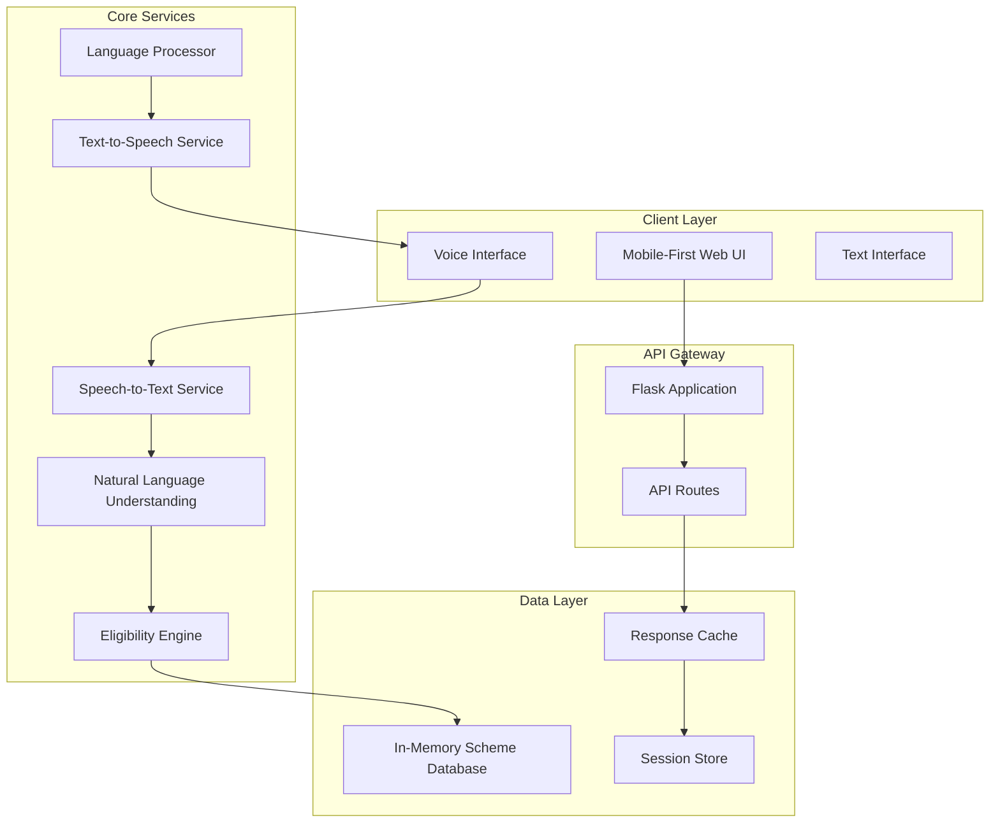

# Design Document: Government Scheme Navigator

## Overview

The Government Scheme Navigator is a voice-first, multilingual AI assistant designed to help citizens discover and access government schemes, welfare programs, and public resources. The system addresses the critical gap in citizen awareness of available programs by providing an inclusive, conversational interface that works effectively in low-bandwidth environments and serves users with varying literacy levels.

The solution employs a Flask-based backend architecture with integrated speech processing capabilities, natural language understanding, and a rule-based eligibility matching engine. The frontend provides a mobile-first, accessible interface that gracefully degrades based on network conditions and device capabilities.

## Architecture

### High-Level Architecture



### Technology Stack

**Backend Framework:**
- Flask 2.3+ with Gunicorn for production deployment
- Python 3.9+ for modern language features and performance

**Speech Processing:**
- SpeechRecognition library as a unified interface for multiple STT engines
- pyttsx3 for offline text-to-speech capabilities
- Web Speech API integration for browser-based voice input

**Natural Language Processing:**
- spaCy for multilingual NLP with pre-trained models
- langdetect for automatic language identification
- Custom intent classification using rule-based patterns

**Frontend Technologies:**
- Vanilla JavaScript with Web APIs for minimal payload
- CSS Grid and Flexbox for responsive design
- Progressive Web App (PWA) capabilities for offline functionality

**Optimization Libraries:**
- Flask-Compress for response compression
- Redis for caching (optional, falls back to in-memory)
- MessagePack for efficient data serialization

## Components and Interfaces

### Voice Interface Component

The Voice Interface manages all speech-related interactions and provides seamless fallback mechanisms.

**Core Responsibilities:**
- Speech-to-text conversion with error handling
- Text-to-speech synthesis with voice selection
- Audio quality optimization for low-bandwidth environments
- Fallback to text input when voice processing fails

**Key Methods:**
```python
class VoiceInterface:
    def transcribe_speech(self, audio_data: bytes) -> TranscriptionResult
    def synthesize_speech(self, text: str, language: str) -> AudioResponse
    def optimize_audio_quality(self, bandwidth_level: str) -> AudioSettings
    def handle_transcription_error(self, error: Exception) -> FallbackResponse
```

### Natural Language Understanding Engine

The NLU Engine processes conversational input and extracts structured information for eligibility matching.

**Intent Classification:**
- Scheme discovery intent ("I need help with housing")
- Information request intent ("Tell me about this program")
- Clarification intent ("Can you repeat that?")
- Navigation intent ("Go back", "Next question")

**Entity Extraction:**
- Demographic entities (age, income, occupation, location)
- Scheme-related entities (benefit types, document names)
- Temporal entities (application deadlines, benefit periods)

**Key Methods:**
```python
class NLUEngine:
    def classify_intent(self, text: str, context: ConversationContext) -> Intent
    def extract_entities(self, text: str, intent: Intent) -> List[Entity]
    def update_conversation_context(self, entities: List[Entity]) -> ConversationContext
    def generate_follow_up_question(self, missing_info: List[str]) -> str
```

### Eligibility Matching Engine

The Eligibility Engine implements rule-based matching logic to determine scheme eligibility based on user demographics.

**Matching Logic:**
- Age-based criteria evaluation
- Income threshold comparisons
- Occupation category matching
- Geographic eligibility verification
- Composite criteria evaluation for complex schemes

**Key Methods:**
```python
class EligibilityEngine:
    def evaluate_eligibility(self, user_profile: UserProfile) -> List[EligibleScheme]
    def check_age_criteria(self, age: int, scheme: Scheme) -> bool
    def check_income_criteria(self, income: float, scheme: Scheme) -> bool
    def check_location_criteria(self, location: str, scheme: Scheme) -> bool
    def rank_schemes_by_relevance(self, schemes: List[EligibleScheme]) -> List[EligibleScheme]
```

### Language Processing Component

The Language Processor handles multilingual support and maintains consistency across different languages.

**Translation Management:**
- Dynamic content translation for scheme information
- Language detection and automatic switching
- Cultural adaptation of explanations and examples
- Consistent terminology across languages

**Key Methods:**
```python
class LanguageProcessor:
    def detect_language(self, text: str) -> str
    def translate_content(self, content: str, target_language: str) -> str
    def adapt_cultural_context(self, content: str, region: str) -> str
    def maintain_terminology_consistency(self, text: str) -> str
```

### API Endpoints

**Primary Endpoints:**

`POST /api/eligibility`
- Accepts user demographic data via voice or text input
- Returns list of eligible schemes with relevance scores
- Supports incremental data collection through conversation

`GET /api/schemes/{scheme_id}`
- Retrieves detailed scheme information
- Returns benefits, requirements, and application guidance
- Supports language-specific content delivery

`POST /api/languages`
- Handles language selection and preference storage
- Manages translation requests for dynamic content
- Returns available language options

**Supporting Endpoints:**

`POST /api/voice/transcribe`
- Processes audio input and returns transcribed text
- Handles multiple audio formats and quality levels
- Provides confidence scores for transcription accuracy

`POST /api/voice/synthesize`
- Converts text responses to speech audio
- Supports multiple voice options and languages
- Optimizes audio quality based on bandwidth

`GET /api/health`
- System health check and performance metrics
- Returns service availability and response times
- Monitors memory usage and cache performance

## Data Models

### User Profile Model

```python
@dataclass
class UserProfile:
    session_id: str
    age: Optional[int] = None
    income: Optional[float] = None
    occupation: Optional[str] = None
    location: Optional[str] = None
    language_preference: str = "en"
    conversation_context: Dict[str, Any] = field(default_factory=dict)
    timestamp: datetime = field(default_factory=datetime.now)
```

### Scheme Model

```python
@dataclass
class Scheme:
    id: str
    name: str
    description: str
    benefits: List[str]
    eligibility_criteria: EligibilityCriteria
    required_documents: List[str]
    application_process: ApplicationProcess
    contact_information: ContactInfo
    translations: Dict[str, SchemeTranslation]
    
@dataclass
class EligibilityCriteria:
    min_age: Optional[int] = None
    max_age: Optional[int] = None
    max_income: Optional[float] = None
    eligible_occupations: List[str] = field(default_factory=list)
    eligible_locations: List[str] = field(default_factory=list)
    additional_criteria: Dict[str, Any] = field(default_factory=dict)
```

### Conversation Context Model

```python
@dataclass
class ConversationContext:
    current_intent: Optional[str] = None
    collected_entities: Dict[str, Any] = field(default_factory=dict)
    conversation_history: List[str] = field(default_factory=list)
    pending_questions: List[str] = field(default_factory=list)
    current_schemes: List[str] = field(default_factory=list)
    language: str = "en"
```

### Response Models

```python
@dataclass
class EligibilityResponse:
    eligible_schemes: List[EligibleScheme]
    next_question: Optional[str] = None
    completion_percentage: float = 0.0
    suggested_actions: List[str] = field(default_factory=list)

@dataclass
class EligibleScheme:
    scheme: Scheme
    relevance_score: float
    missing_criteria: List[str] = field(default_factory=list)
    confidence_level: str = "high"
```

## Correctness Properties

*A property is a characteristic or behavior that should hold true across all valid executions of a system—essentially, a formal statement about what the system should do. Properties serve as the bridge between human-readable specifications and machine-verifiable correctness guarantees.*

### Property 1: Voice Processing Accuracy and Performance
*For any* speech input containing demographic information, the Voice_Interface should transcribe it with sufficient accuracy for eligibility matching and complete processing within 2 seconds, with fallback to text input when transcription fails.
**Validates: Requirements 1.1, 1.3, 1.5**

### Property 2: Dual Input Method Support
*For any* user session, both voice and text input methods should be available simultaneously and produce equivalent results for the same demographic information.
**Validates: Requirements 1.4**

### Property 3: Multilingual Consistency
*For any* supported language selection, all system interactions and scheme information should be consistently presented in that language throughout the session, with all required content available in each supported language.
**Validates: Requirements 2.1, 2.2, 2.3**

### Property 4: Conversational Eligibility Discovery
*For any* new user session, the system should ask all required demographic questions (age, income, occupation, location) one at a time, and immediately match provided information against scheme criteria in real-time.
**Validates: Requirements 3.1, 3.2, 3.3**

### Property 5: Complete Eligibility Results
*For any* completed demographic profile, the system should return all matching schemes with descriptions, or provide alternative suggestions and clarifying questions when no schemes match.
**Validates: Requirements 3.4, 3.5**

### Property 6: Comprehensive Scheme Information
*For any* selected scheme, the system should provide benefits information, required documents in checklist format, step-by-step application instructions for both online and offline processes, and location-based office/portal suggestions when applicable.
**Validates: Requirements 4.1, 4.2, 4.3, 4.4**

### Property 7: Low-Bandwidth Performance
*For any* system interaction under low-bandwidth conditions, responses should complete within 3 seconds using compressed data formats and minimal network requests, with graceful degradation to essential functionality when connectivity is poor.
**Validates: Requirements 5.1, 5.2, 5.4**

### Property 8: Intelligent Caching
*For any* frequently accessed scheme data, the system should cache it locally and retrieve from cache on subsequent requests to optimize performance.
**Validates: Requirements 5.5**

### Property 9: Data Privacy Protection
*For any* user session, the system should obtain explicit consent before processing personal data, clear all personal information from memory when the session ends, and never store demographic information in permanent storage while using secure communication protocols.
**Validates: Requirements 6.1, 6.2, 6.3, 6.4**

### Property 10: Comprehensive Accessibility
*For any* user interface element, the system should provide screen reader support with proper ARIA labels, high contrast and scalable text options, alternative input methods when voice is unavailable, visual feedback for audio cues, and simple touch/click interactions without complex gestures.
**Validates: Requirements 7.1, 7.2, 7.3, 7.4, 7.5**

### Property 11: Natural Language Understanding
*For any* conversational user input, the Language_Processor should extract relevant demographic entities, classify intents (scheme discovery, help requests, clarification), and maintain conversation context throughout the session.
**Validates: Requirements 8.1, 8.2, 8.5**

### Property 12: Intelligent Conversation Management
*For any* incomplete user information or expressed confusion, the system should generate appropriate follow-up questions or provide clarification and repeat information as needed.
**Validates: Requirements 8.3, 8.4**

### Property 13: Dynamic Scheme Data Management
*For any* scheme information in the database, it should be stored in a structured format that supports immediate updates without system restart, automatic inclusion of new schemes in eligibility matching, simplified explanations for citizen consumption, and location-specific variations.
**Validates: Requirements 9.1, 9.2, 9.3, 9.4, 9.5**

### Property 14: Concurrent Performance
*For any* system load with multiple simultaneous users, response times should remain under 3 seconds for general interactions and under 1 second for eligibility matching, with efficient handling of concurrent voice processing requests.
**Validates: Requirements 10.1, 10.2, 10.4**

### Property 15: Memory Management
*For any* user session data, the system should manage memory efficiently to prevent leaks and maintain performance as usage grows.
**Validates: Requirements 10.5**

## Error Handling

### Voice Processing Errors
- **Transcription Failures**: Automatic fallback to text input with clear user notification
- **Audio Quality Issues**: Dynamic quality adjustment based on bandwidth and device capabilities
- **Language Detection Errors**: Graceful fallback to default language with option to manually select

### Network and Performance Errors
- **Low Bandwidth**: Progressive feature degradation while maintaining core eligibility functionality
- **Timeout Handling**: Retry mechanisms with exponential backoff for transient failures
- **Service Unavailability**: Cached responses and offline capability for essential features

### Data and Processing Errors
- **Invalid User Input**: Gentle correction with examples and clarification questions
- **Scheme Data Inconsistencies**: Validation checks with fallback to simplified information
- **Session Management**: Automatic session recovery and state restoration

### Accessibility Errors
- **Screen Reader Compatibility**: Comprehensive ARIA labeling and semantic HTML structure
- **Input Method Failures**: Multiple alternative input pathways
- **Visual Impairment Support**: High contrast modes and scalable interface elements

## Testing Strategy

### Dual Testing Approach

The testing strategy employs both unit testing and property-based testing to ensure comprehensive coverage:

**Unit Tests** focus on:
- Specific examples of voice transcription accuracy
- Edge cases in eligibility matching logic
- Error conditions and fallback mechanisms
- Integration points between components
- Accessibility compliance verification

**Property-Based Tests** focus on:
- Universal properties across all possible inputs
- Comprehensive input coverage through randomization
- Performance characteristics under varying conditions
- Data consistency and integrity across operations

### Property-Based Testing Configuration

**Testing Framework**: Hypothesis for Python property-based testing
**Test Configuration**: Minimum 100 iterations per property test
**Test Tagging**: Each property test references its design document property using the format:
`# Feature: government-scheme-navigator, Property {number}: {property_text}`

### Testing Implementation Requirements

- Each correctness property must be implemented by a single property-based test
- Property tests validate universal behaviors across randomized inputs
- Unit tests complement property tests by covering specific scenarios and edge cases
- Integration tests verify end-to-end workflows and component interactions
- Performance tests validate response time requirements under various load conditions

### Test Data Management

- Synthetic scheme data generation for testing eligibility matching
- Multilingual test content for language processing validation
- Audio sample generation for voice processing tests
- Accessibility testing with automated tools and manual verification
- Security testing for data privacy and protection measures
